<h2>TP 4 : JavaFX</h2>
<h4>L'objectif du TP : </h4>

<h4>Réalisation : </h4>

<b>1 - class Product </b>

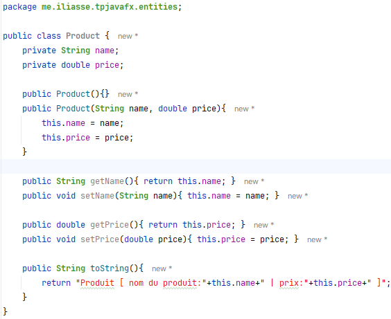
 

<b>2 - la vue product-view </b>

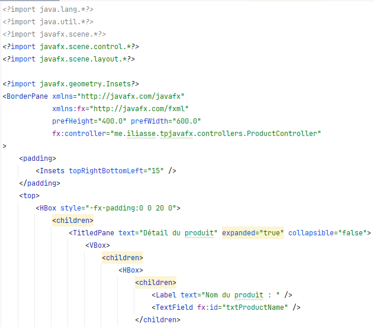
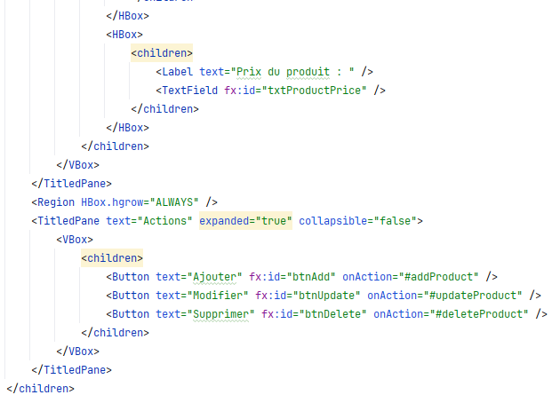
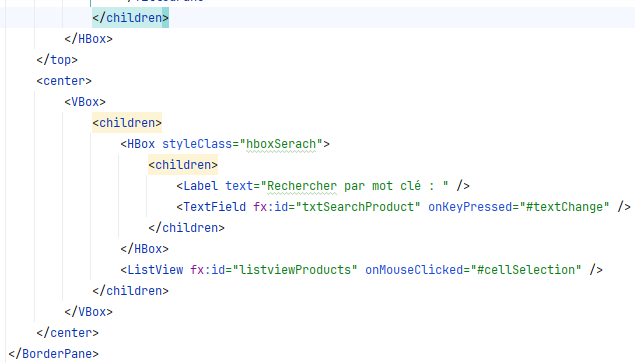
 

<b>3 - le controlleur ProductController </b>

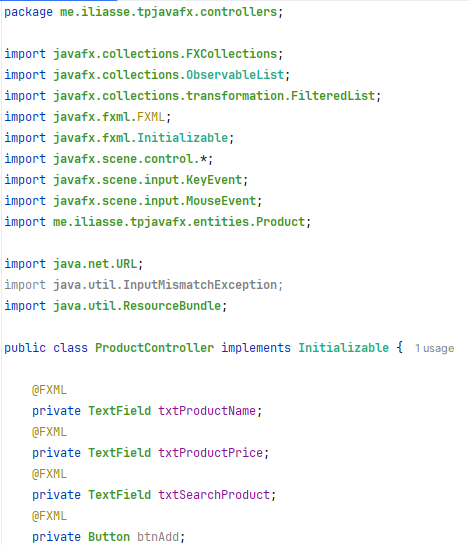
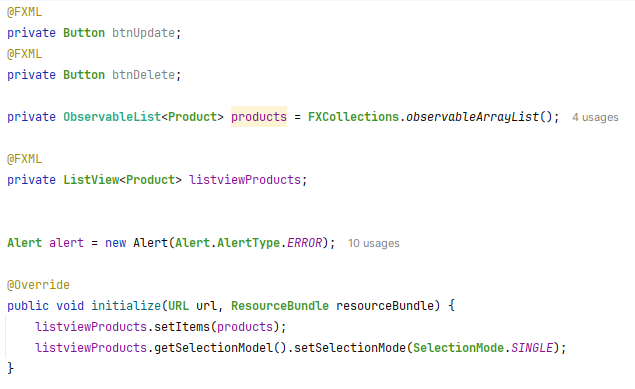
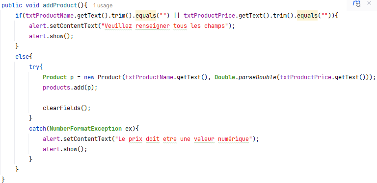
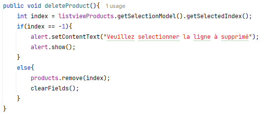
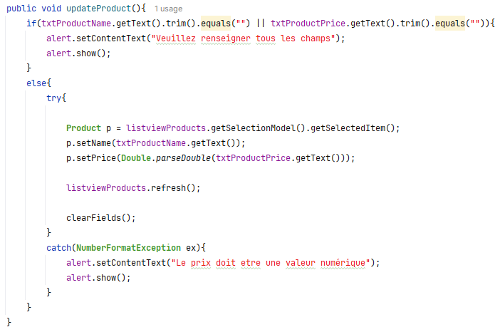
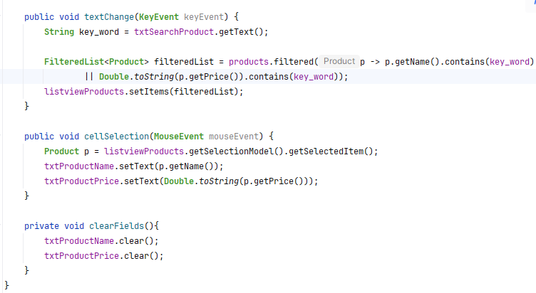

 

<b>4 - Feuille de style css </b>

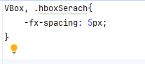
 

<b>5 - La class Application (point d'entrée de l'application) </b>

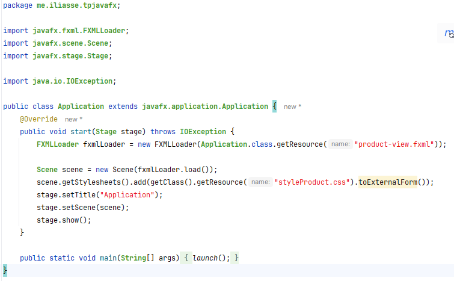
 

<b>L'iterface utilisateur de l'application</b>

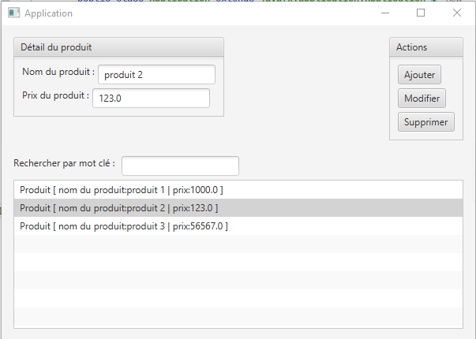
